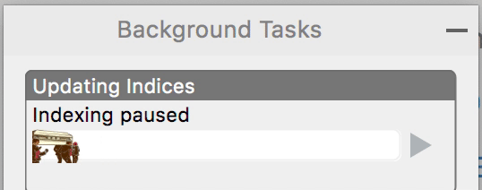
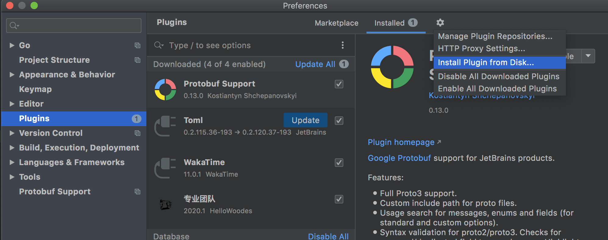

# 专业团队

----

## 使用方法 

1. 下载 [1.0](https://github.com/helloworlde/professional-team/releases/download/1.0/ProTeam.jar) 版本的 Jar 到本地
2. 打开 IDE设置 -> plugins -> 右上角设置图标 -> Install Plugin from Disk -> 选择下载的文件 即可 

-----

## 参考

- [NyanProgressBar](https://github.com/batya239/NyanProgressBar)
- [gopher](https://github.com/dlsniper/gopher)